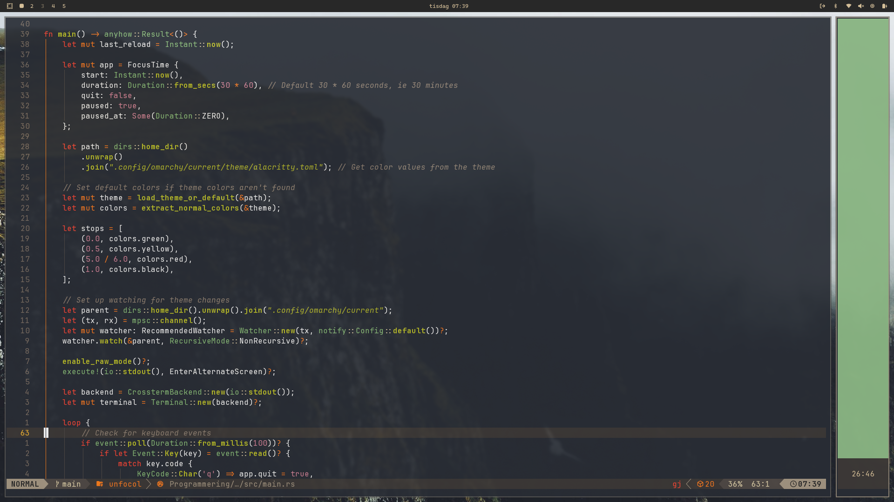
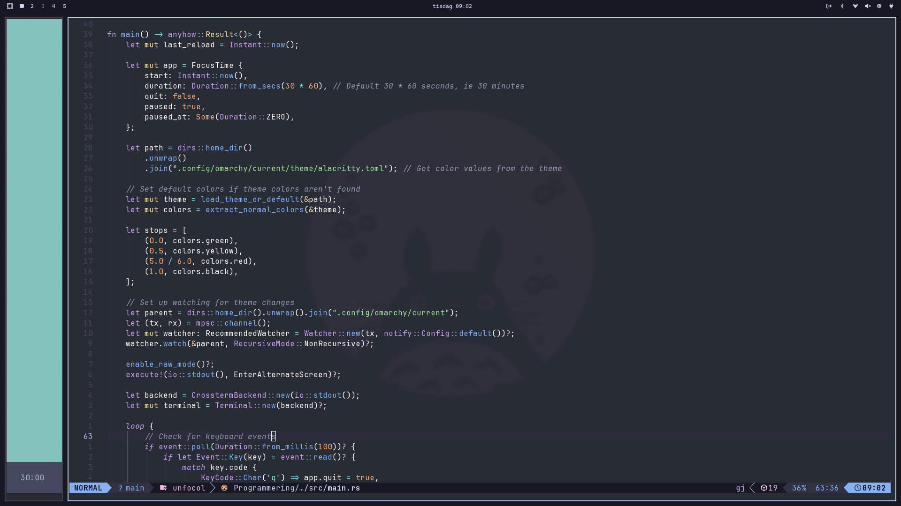
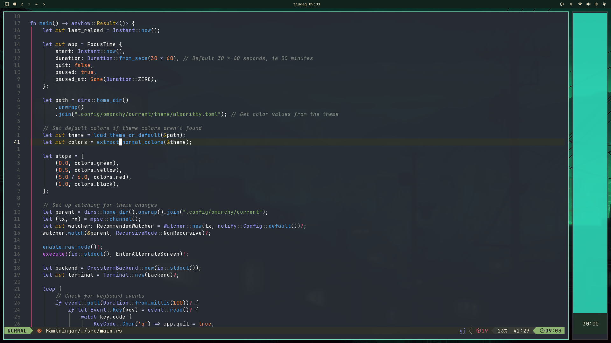

# Unfocol

**unfocol** (UNfocused FOcus using COLors) is a small focus timer.
It displays a block of color that changes gradually over time. The idea is
to give a peripheral sense of time passing without having to look at a
countdown.

This is **v2**, rewritten with [egui]/[eframe] instead of Ratatui. Where v1
was a TUI wired specifically to the Omarchy (Arch + Hyprland) distro, v2 is
a normal cross-platform GUI window that runs on Linux, macOS and Windows.
Omarchy is still supported as a first-class citizen (see
[Omarchy integration](#omarchy-integration)), it is just no longer required.

Here are some screenshots of v1 running in different terminal themes, with a
compressed version of how the transitions should look underneath. v2 renders
its own window rather than a terminal cell block, but the colour progression
is the same:

| Gruvbox | Catppuccin | Osaka Jade |
|---------|------------|------------|
|  |  |  |
|  |  |  |

## Usage

Start it. Make it a small strip on either the right or left side of the
screen and let what you're working on fill the rest of the screen. The
window is borderless and can be dragged from anywhere inside it, resized,
and it remembers its last position and size. By default it opens as a thin
full-height strip near the right edge of the screen.

Keyboard controls:

| Key | Action |
|-----|--------|
| `Space` | Start / pause the focus timer |
| `R` | Reset the timer |
| `S` or `,` | Open settings |
| `Q` | Quit |
| `Esc` | Close the settings window |

A focus session is 25 minutes by default and can be set to anything from 1
to 99 minutes in settings. The colour fades from what the active theme
calls green, to yellow around the halfway mark, to red near the end, and
then to black before returning to the theme's idle colour once the time is
up. There is a small clock, but the point is *not* to look at it, and
instead get a feeling for how much time is left from the colour alone. When
the clock is shown can be set to always, never, or only while the mouse is
over the window.

Window placement is left to your compositor / window manager. To pin
unfocol to a fixed position and size, use window rules (for example
Hyprland `windowrule` entries matched on the app id `se.johnkinell.Unfocol`).

## Configuration

On first run unfocol creates a config directory containing `themes.toml`
and `settings.toml`:

| OS | Path |
|----|------|
| Linux | `~/.config/unfocol/` |
| macOS | `~/Library/Application Support/se.johnkinell.Unfocol/` |
| Windows | `%APPDATA%\johnkinell\Unfocol\config\` |

`settings.toml` is written automatically whenever you change something in
the settings window; you normally don't need to edit it by hand.

`themes.toml` holds the colour themes. Each theme has an `idle` colour and
a list of gradient `stops`, each with a `progress` from `0.0` (session
start) to `1.0` (session end) and a colour. A few themes ship built in
(`default`, `nord`, `gruvbox_dark`, `catpuccin_latte`, `black_white`,
`orange_teal`); add your own by appending to the file. Optional
`clock_bg` and `clock_digits` keys set the clock colours per theme.

```toml
[themes.my_theme]
idle = "#88c0d0"
clock_bg = "#3b4252"
clock_digits = "#eceff4"

[[themes.my_theme.stops]]
progress = 0.0
color = "#a3be8c"

[[themes.my_theme.stops]]
progress = 0.5
color = "#ebcb8b"

[[themes.my_theme.stops]]
progress = 1.0
color = "#2e3440"
```

Pick the active theme in the settings window.

## Installation

### From the AUR (recommended)

The preferred way to install on Arch-based systems is the
[`unfocol-bin`](https://aur.archlinux.org/packages/unfocol-bin) package.

With `yay`:
```bash
yay -S unfocol-bin
```

With `paru`:
```bash
paru -S unfocol-bin
```

### Build from source

Needs a recent stable Rust toolchain. On Linux you also need the usual
GUI/OpenGL/Wayland development headers (`libxkbcommon`, `libwayland`,
`libxcb-*`, Mesa GL/EGL — names vary by distro).

```bash
git clone https://github.com/MrOnijohn/unfocol.git
cd unfocol
cargo build --release
```

Copy the binary somewhere on your `PATH`:
```bash
install -Dm755 target/release/unfocol ~/.local/bin/unfocol
```

### macOS and Windows

> **Not tested.** I develop and run unfocol on Linux and do not use macOS or
> Windows. Binaries for those platforms are built by CI and attached to
> releases purely as a courtesy — they are unsigned, unnotarised, and I
> cannot promise they work or keep working. Treat them as best-effort.

Pre-built archives are attached to each
[GitHub release](https://github.com/MrOnijohn/unfocol/releases):

- **macOS (Apple Silicon):** `unfocol-<version>-aarch64-apple-darwin.tar.gz`
- **Windows (x86-64):** `unfocol-<version>-x86_64-pc-windows-msvc.zip`

Each archive has a matching `.sha256` file you can verify against.

**macOS:**
```bash
tar -xzf unfocol-*-aarch64-apple-darwin.tar.gz
xattr -d com.apple.quarantine unfocol   # Gatekeeper blocks unsigned binaries
mv unfocol /usr/local/bin/
```

**Windows:** extract the `.zip` and run `unfocol.exe`. SmartScreen will
warn about an unrecognised app; there is no code signature. Put the
executable wherever you like and, if you want, add its folder to `PATH`.

Building from source with `cargo build --release` also works on both
platforms if you have the Rust toolchain installed, and is the route I'd
actually trust.

## Omarchy integration

When running under [Omarchy], unfocol automatically picks up the active
Omarchy theme's palette from:

```
~/.local/state/omarchy/current/theme/colors.toml
```

If that file exists, an extra `"Omarchy"` theme is added to the theme list,
and it live-reloads whenever you switch Omarchy themes. If the file isn't
there (i.e. you're not on Omarchy) nothing happens and the built-in themes
are used as normal. This detection only runs on Linux.

## License

MIT, see [LICENSE](LICENSE).

[egui]: https://github.com/emilk/egui
[eframe]: https://github.com/emilk/egui/tree/master/crates/eframe
[Omarchy]: https://omarchy.org
